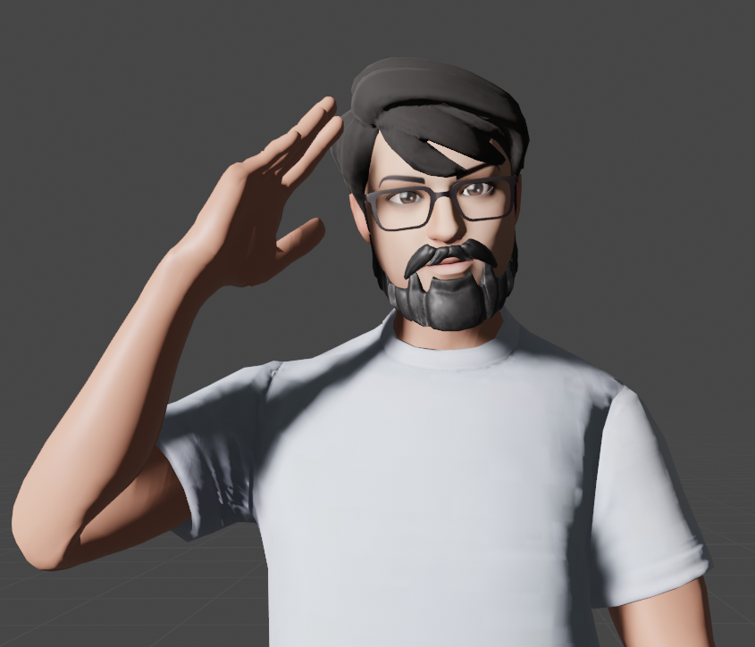

<!-- Improved compatibility of back to top link: See: https://github.com/othneildrew/Best-README-Template/pull/73 -->
<a name="readme-top"></a>
<!--
*** Thanks for checking out the Best-README-Template. If you have a suggestion
*** that would make this better, please fork the repo and create a pull request
*** or simply open an issue with the tag "enhancement".
*** Don't forget to give the project a star!
*** Thanks again! Now go create something AMAZING! :D
-->


<!-- PROJECT SHIELDS -->
<!--
*** I'm using markdown "reference style" links for readability.
*** Reference links are enclosed in brackets [ ] instead of parentheses ( ).
*** See the bottom of this document for the declaration of the reference variables
*** for contributors-url, forks-url, etc. This is an optional, concise syntax you may use.
*** https://www.markdownguide.org/basic-syntax/#reference-style-links
-->
[![Contributors][contributors-shield]][contributors-url]
[![Forks][forks-shield]][forks-url]
[![Stargazers][stars-shield]][stars-url]
[![Issues][issues-shield]][issues-url]
[![MIT License][license-shield]][license-url]
[![LinkedIn][linkedin-shield]][linkedin-url]

<!-- PROJECT LOGO -->
<br />
<div align="center">
    <a href="https://github.com/suweed/myportfolio">
        
    </a>
    <h3 align="center">Mi portafolio tipo 1</h3>
    <p align="center">
        Un ejemplo de como puede ser mi portafolio personal
        <br />
        <a href="https://github.com/suweed/myportfolio"><strong>Explore the docs »</strong></a>
        <br />
        <br />
        <a href="https://github.com/suweed/myportfolio">View Demo</a>
        ·
        <a href="https://github.com/suweed/myportfolio/issues">Report Bug</a>
        ·
        <a href="https://github.com/suweed/myportfolio/issues">Request Feature</a>
    </p>
</div>

<!-- TABLE OF CONTENTS -->
<details>
  <summary>Table of Contents</summary>
  <ol>
    <li>
      <a href="#about-the-project">About The Project</a>
      <ul>
        <li><a href="#built-with">Built With</a></li>
      </ul>
    </li>
    <li>
      <a href="#getting-started">Getting Started</a>
      <ul>
        <li><a href="#prerequisites">Prerequisites</a></li>
        <li><a href="#installation">Installation</a></li>
      </ul>
    </li>
    <li><a href="#contact">Contact</a></li>
  </ol>
</details>

<!-- ABOUT THE PROJECT -->
## About The Project

[![Product Name Screen Shot][product-screenshot]](https://example.com)

Este es un proyecto para crear un tipo de portafolio como practica de react three fiber, se usan conceptos basicos para crear una escena, usar un avatar, crear varias paginas con un scrol animado, uso de animaciones para los modelos 3D

<p align="right">(<a href="#readme-top">volver al principio</a>)</p>

### Built With

* [![React][React.js]][React-url]
* [![Three][Threejs]][Three-url]
* [![Vite][Vite]][Vite-url]
* [![Javascript][Javascript]][Javascript-url]
* [![Tailwind][Tailwind]][Tailwind-url]

<p align="right">(<a href="#readme-top">volver al principio</a>)</p>


<!-- GETTING STARTED -->
## Getting Started

Proyecto basico generado con Vite, usando React y javascript, con npm se instalaron las librerias de @react-three/drei @react-three/fiber 

### Prerequisites

* node
  - https://nodejs.org/es
* vite
  - https://es.vitejs.dev/
* npm
  - https://www.npmjs.com/
  ```sh
  npm create vite .
  npm install dev
  npm run dev
  ```

### Installation

1. Clone the repo
   ```sh
   git clone https://github.com/suweed/myportfolio.git
   ```
2. Unzip rar file (model myroomScreen.gltf compress)
  ```sh
  /public/models/room/room.rar en /public/models/
  ```
3. Install NPM packages
   ```sh
   npm install
   ```
4. start project
   ```npm
   npm run dev
   ```

<p align="right">(<a href="#readme-top">volver al principio</a>)</p>

<!-- LICENSE -->
## License

Distribuido bajo la licencia MIT. Consulte `LICENCIA.txt` para obtener más información.

<p align="right">(<a href="#readme-top">volver al principio</a>)</p>

<!-- CONTACT -->
## Contact

Jesús Cardozo - [@dRsUgAr1221](https://twitter.com/dRsUgAr1221) - gsuskr2o@gmail.com

Project Link: [https://github.com/suweed/myportfolio](https://github.com/suweed/myportfolio)

<p align="right">(<a href="#readme-top">volver al principio</a>)</p>

<!-- MARKDOWN LINKS & IMAGES -->
<!-- https://www.markdownguide.org/basic-syntax/#reference-style-links -->
[contributors-shield]: https://img.shields.io/github/contributors/suweed/myportfolio.svg?style=for-the-badge
[contributors-url]: https://github.com/suweed/myportfolio/graphs/contributors
[forks-shield]: https://img.shields.io/github/forks/suweed/myportfolio.svg?style=for-the-badge
[forks-url]: https://github.com/suweed/myportfolio/network/members
[stars-shield]: https://img.shields.io/github/stars/suweed/myportfolio.svg?style=for-the-badge
[stars-url]: https://github.com/suweed/myportfolio/stargazers
[license-shield]: https://img.shields.io/github/license/suweed/myportfolio.svg?style=for-the-badge
[license-url]: https://github.com/suweed/myportfolio/LICENSE.txt
[issues-shield]: https://img.shields.io/github/issues/suweed/myportfolio.svg?style=for-the-badge
[issues-url]: https://github.com/suweed/myportfolio/issues
[linkedin-shield]: https://img.shields.io/badge/-LinkedIn-black.svg?style=for-the-badge&logo=linkedin&colorB=555
[linkedin-url]: https://linkedin.com/in/linkedin_username
[product-screenshot]: public/models/homepage.jpg
[React.js]: https://img.shields.io/badge/React-20232A?style=for-the-badge&logo=react&logoColor=61DAFB
[React-url]: https://reactjs.org/
[Threejs]: https://img.shields.io/badge/three-20232A?style=for-the-badge&logo=threedotjs
[Three-url]: https://threejs.org/
[Vite]: https://img.shields.io/badge/vite-20232A?style=for-the-badge&logo=vite
[Vite-url]: https://vitejs.dev/
[Javascript]: https://img.shields.io/badge/javascript-20232A?style=for-the-badge&logo=javascript
[Javascript-url]: https://lenguajejs.com/javascript/
[Tailwind]: https://img.shields.io/badge/Tailwind-20232A?style=for-the-badge&logo=tailwindcss&logoColor=61DAFB
[Tailwind-url]: https://tailwindcss.com/

